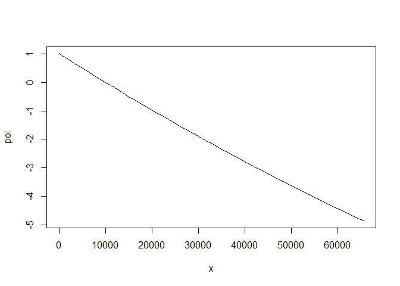

# Polynomial Interpolation


<!-- Polynomial Interpolation -->

In real-world engineering projects, precise modelling is not always
feasible. However, approximations can be effective. Both development-
and production-level embedded projects can use estimates based on
limited knowledge and employ an estimator function to fill in the gaps.
Future work will normally provide valuable insights for replacement
later on. The gaps tend to fill up, given time.

# Sandia’s Fortran

Sandia Laboratories has a useful pair of polynomial interpolation
functions called [`polint`](https://netlib.org/slatec/src/polint.f) and
[`polyvl`](https://netlib.org/slatec/src/polyvl.f). The authors
originally wrote in Fortran. A C99 translation follows. The languages
share some similarities, as well as some differences. Fortran uses
one-based array indices whereas C uses zero, for instance. The
translation is pretty straightforward, nevertheless.

``` cpp
#pragma once

/*
 * for size_t
 */
#include <stddef.h>

#ifdef __cplusplus
extern "C" {
#endif

enum slatec_polint_status {
  slatec_polint_success,
  slatec_polint_failure = -1,
  slatec_polint_abscissae_not_distinct = -2
};

/*!
 * \brief Double-precision polynomial interpolation.
 *
 * \details Function \c slatec_polint generates a polynomial that interpolates
 * the vectors \c x[i] by \c y[i] where \c i ranges from 1 to \c{n}. It prepares
 * information in the array \c c that can be utilized by the subroutine \c
 * polyvl to calculate the polynomial and its derivatives.
 *
 * \see https://netlib.org/slatec/src/polint.f
 */
static inline enum slatec_polint_status
slatec_polint(size_t n, const double x[], const double y[], double c[]) {
  if (n == 0)
    return slatec_polint_failure;
  c[0] = y[0];
  if (n == 1)
    return slatec_polint_success;
  for (size_t k = 1; k < n; k++) {
    c[k] = y[k];
    for (size_t i = 0; i < k; i++) {
      const double dif = x[i] - x[k];
      if (dif == 0)
        return slatec_polint_abscissae_not_distinct;
      c[k] = (c[i] - c[k]) / dif;
    }
  }
  return slatec_polint_success;
}

/*!
 * \brief Single-precision polynomial interpolation.
 */
static inline enum slatec_polint_status
slatec_polintf(size_t n, const float x[], const float y[], float c[]) {
  if (n == 0)
    return slatec_polint_failure;
  c[0] = y[0];
  if (n == 1)
    return slatec_polint_success;
  for (size_t k = 1; k < n; k++) {
    c[k] = y[k];
    for (size_t i = 0; i < k; i++) {
      const float dif = x[i] - x[k];
      if (dif == 0)
        return slatec_polint_abscissae_not_distinct;
      c[k] = (c[i] - c[k]) / dif;
    }
  }
  return slatec_polint_success;
}

#ifdef __cplusplus
}
#endif
```

The style differs. Fortran does not support `const`. Arguments pass by
reference. No pointers exist; not explicitly at any rate. Fortran
arguments pass by reference. The polynomial generator’s interface at
least proves relatively self-explanatory: give it a matching pair of
vectors $(x_i,y_i): i\in[0,n)$ and it generates $c_i$ which subsequently
interpolate using $(x_i, c_i)$ in the following function.

``` cpp
#pragma once

/*
 * for size_t
 */
#include <stddef.h>

#ifdef __cplusplus
extern "C" {
#endif

enum slatec_polyvl_status { slatec_polyvl_success, slatec_polyvl_failure = -1 };

/*!
 * \brief Computes polynomial double-precision values.
 *
 * \details Calculates the value of a polynomial where the polynomial was
 * produced by a previous call to \c{polint}. The argument \c n and the arrays
 * \c x and \c c must not be altered between the call to \c polint and the call
 * to \c{slatec_polyvl}.
 *
 * Simplifies the original Fortran.
 *
 * \see https://netlib.org/slatec/src/polyvl.f
 */
static inline enum slatec_polyvl_status slatec_polyvl(double xx, double *yy,
                                                      size_t n,
                                                      const double x[],
                                                      const double c[]) {
  if (n == 0)
    return slatec_polyvl_failure;
  double pione = 1, pone = c[0];
  if (n == 1) {
    *yy = pone;
    return slatec_polyvl_success;
  }
  double ptwo;
  for (size_t k = 1; k < n; k++) {
    const double pitwo = (xx - x[k - 1]) * pione;
    pione = pitwo;
    ptwo = pone + pitwo * c[k];
    pone = ptwo;
  }
  *yy = ptwo;
  return slatec_polyvl_success;
}

/*!
 * \brief Computes polynomial single-precision values.
 */
static inline enum slatec_polyvl_status slatec_polyvlf(float xx, float *yy,
                                                       size_t n,
                                                       const float x[],
                                                       const float c[]) {
  if (n == 0)
    return slatec_polyvl_failure;
  float pione = 1, pone = c[0];
  if (n == 1) {
    *yy = pone;
    return slatec_polyvl_success;
  }
  float ptwo;
  for (size_t k = 1; k < n; k++) {
    const float pitwo = (xx - x[k - 1]) * pione;
    pione = pitwo;
    ptwo = pone + pitwo * c[k];
    pone = ptwo;
  }
  *yy = ptwo;
  return slatec_polyvl_success;
}

#ifdef __cplusplus
}
#endif
```

Again, the interface is simple: one abscissa in by value, one ordinate
out by reference. The vector size $n$ determines the order of the
polynomial. A one-vector $n=1$ interpolates a flat line equivalent to
$y=c$; the next order $n=2$ interpolates a straight line equivalent to
$y=mx+c$; order $n=3$ for cubic and so on.

# Usage

Usage has two phases. Firstly, the interpolator computes the
derivatives. Use as often as necessary after that if the interpolation
requires an update. The first phase only initialises. Thereafter, any
number of interpolated values come cheaply from a compute usage point of
view. Simply give an abscissa $x$ and see the corresponding ordinate
$y$. Usage example below.

``` cpp
#include <stdio.h>
#include <stdlib.h>
#include <unistd.h>

#include "slatec_polint.h"
#include "slatec_polyvl.h"

int main(int argc, char *argv[]) {
  double a = -1, b = 1, d = 0.1;
  int opt;
  while ((opt = getopt(argc, argv, "a:b:d:")) != -1)
    switch (opt) {
    case 'a':
      a = atof(optarg);
      break;
    case 'b':
      b = atof(optarg);
      break;
    case 'd':
      d = atof(optarg);
    }

  size_t n = 0;
  double *x = NULL, *y = NULL;
  while (optind < argc &&
         (x = realloc(x, sizeof(*x) * (n + 1))) != NULL &&
         (y = realloc(y, sizeof(*y) * (n + 1))) != NULL &&
         sscanf(argv[optind++], " %lf,%lf", x + n, y + n) == 2)
    n++;

  double *c = calloc(n, sizeof(*c));
  if (c == NULL)
    return EXIT_FAILURE;

  enum slatec_polint_status status = slatec_polint(n, x, y, c);
  if (status != slatec_polint_success)
    return EXIT_FAILURE;

  for (double xx = a; xx < b; xx += d) {
    double yy;
    enum slatec_polyvl_status status = slatec_polyvl(xx, &yy, n, x, c);
    if (status != slatec_polyvl_success)
      return EXIT_FAILURE;
    printf("%lf,%lf\n", xx, yy);
  }
  return EXIT_SUCCESS;
}
```

The example encodes a command-line tool that scans the command-line
arguments for comma-separated floating-point number pairs, $x$ and $y$
terms for a polynomial. The number of pairs determines its order. Its
error handling is basic but it only exists for demonstration purposes.

# Testbed

The following piece of C++ wraps the polynomial functions in R-language
clothing.

``` cpp
#include "slatec_polint.h"
#include "slatec_polyvl.h"
#include <Rcpp.h>

using namespace Rcpp;

/*
 * `NumericVector` is an R wrapper for the C++ `std::vector` type.
 */

// [[Rcpp::export]]
int polint(size_t n, NumericVector x, NumericVector y, NumericVector c) {
  return slatec_polint(n, x.cbegin(), y.cbegin(), c.begin());
}

// [[Rcpp::export]]
int polyvl(double xx, NumericVector yy, size_t n, NumericVector x, NumericVector c) {
  return slatec_polyvl(xx, yy.begin(), n, x.cbegin(), c.begin());
}
```

This compiles and double-wraps in R using the following R functions that
prepare the vectors. The last little function `slatec_pol` vectorises
and localises an interpolation and returns an evaluation function so
that it will cache the $(x_i, c_i)$ matrix and happily accept input
vectors.

``` r
Rcpp::sourceCpp("slatec.cpp")

slatec_polint <- \(x = numeric(), y = numeric()) {
  n <- length(x)
  stopifnot(n == length(y))
  c <- numeric(n)
  stopifnot(0L == polint(n, x, y, c))
  cbind(x, c)
}

slatec_polyvl <- \(xx = numeric(1L), xc = numeric()) {
  yy <- numeric(1L)
  n <- nrow(xc)
  x <- xc[, "x"]
  c <- xc[, "c"]
  stopifnot(0L == polyvl(xx, yy, n, x, c))
  yy
}

slatec_pol <- \(x, y) Vectorize(local({
  xc <- slatec_polint(x, y)
  \(xx) slatec_polyvl(xx, xc)
}))
```

Evaluate a cubic polynomial on

$$
\left[\begin{smallmatrix}
10000&0\\
500&0.5\\
100&1\\
\end{smallmatrix}\right]
$$

where $x=10000$ maps to $y=0$, $x=500$ maps to $y=0.5$ and $x=100$ maps
to $y=1$, or in other words, the resulting interpolation will normalise
an inverted slightly linear $10000..100$ signal.

Derive the polynomial.

``` r
pol <- slatec_pol(x = c(10000, 5000, 100), y = c(0, 0.5, 1))
```

Plot the function over $x=0..65535$.

``` r
plot(pol, 0, 65535)
```



Exactly what is required.

# Conclusions

The polynomial interpolator is a computing tool. The tool translates
between two real spaces, $x\in\mathbb{X}$ to $y\in\mathbb{Y}$. The
translation interpolates every abscissa in $\mathbb{X}$ to some ordinate
in $\mathbb{Y}$. The interpolation utilises one or more arbitrary $x,y$
input-output pairings. The order of the pairings does not matter. The
translation extends beyond the near and far pairing boundaries; it
continues before the lowest $x$ and after the highest $x$.

The tool does **not** offer a reverse translation, but the reverse
becomes trivial by reversing $x$ and $y$ using a secondary interpolator.
Setting up an interpolation is cheap in computing resources.
